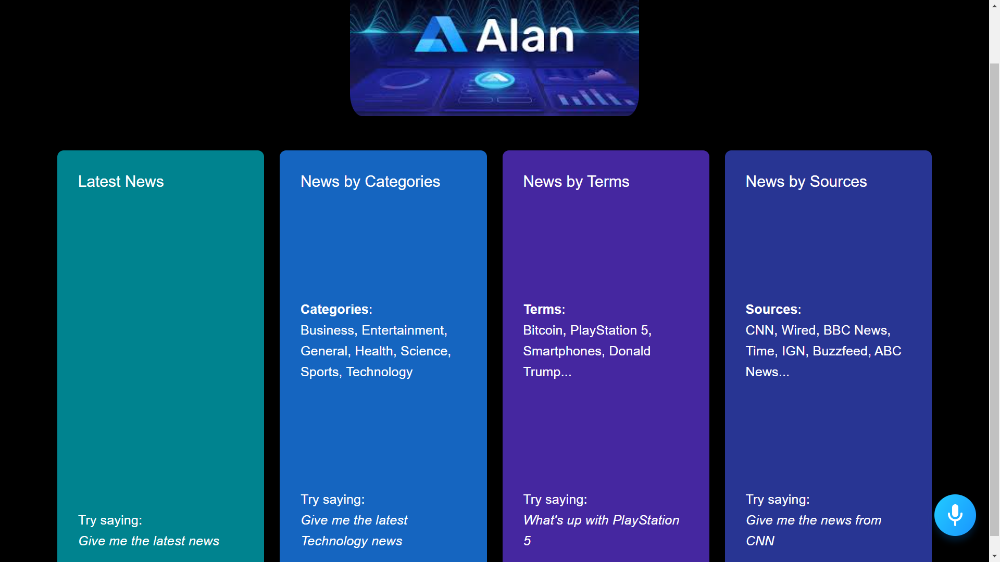

# Site is deployed here-https://kotwani2883.github.io/Voice-Assistant/

* Built using Alan-AI
Alan is an advanced Voice AI Platform that allows you to add a voice interface to your app without overhead. Alan provides a complete serverless environment to build robust and reliable in-app voice assistants and chatbots.Alan also scrolls itself down according to size of the Page.Also we can directly open article by speakinf open article and Go back commands

### NPM packages used
1.Alan-ai/alan-sdk-web
2.Material-ui/core
3.classnames
4.words to number(Open command)
